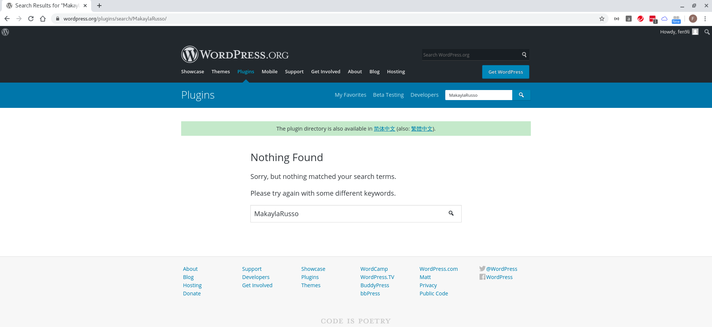
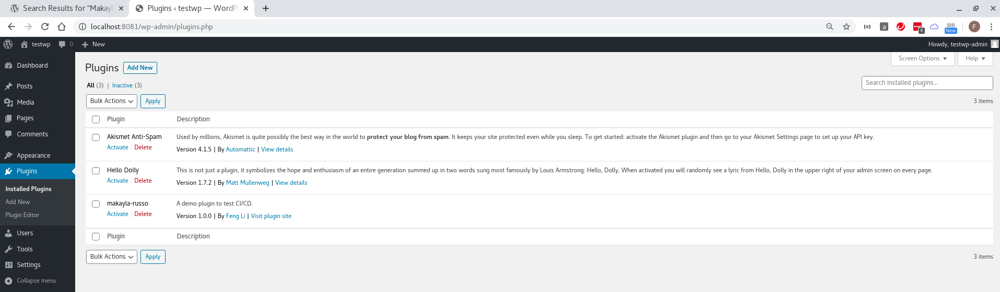
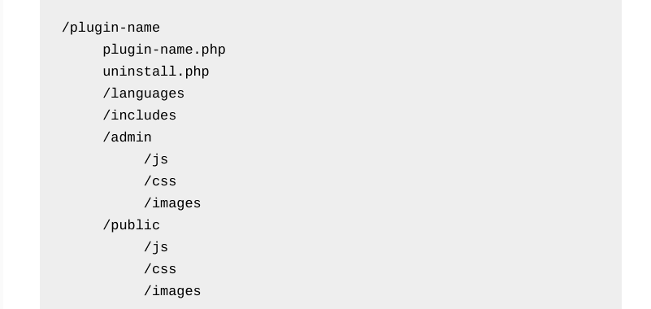

## developing 1st plugin

* start local developing environment
```
[fli@192-168-1-4 easy-wordpress-docker]$ pwd
/home/fli/easy-wordpress-docker
[fli@192-168-1-4 easy-wordpress-docker]$ 

[fli@192-168-1-4 easy-wordpress-docker]$ docker-compose up -d
Creating network "easy-wordpress-docker_backend" with driver "bridge"
Creating wordpress-db ... done
Creating phpmyadmin    ... done
Creating wordpress-web ... done
Creating wordpress-cli ... done
[fli@192-168-1-4 easy-wordpress-docker]$ 

[fli@192-168-1-4 easy-wordpress-docker]$ docker container ls
CONTAINER ID        IMAGE                          COMMAND                  CREATED             STATUS              PORTS                    NAMES
d65b0ab80d2a        wordpress-cli                  "docker-entrypoint.s…"   47 seconds ago      Up 41 seconds                                wordpress-cli
f481c9e9680a        wordpress-web                  "docker-php-entrypoi…"   51 seconds ago      Up 46 seconds       0.0.0.0:8081->80/tcp     wordpress-web
eba2488f0c26        phpmyadmin/phpmyadmin:latest   "/docker-entrypoint.…"   51 seconds ago      Up 46 seconds       0.0.0.0:8080->80/tcp     phpmyadmin
3545888366c8        wordpress-db                   "docker-entrypoint.s…"   55 seconds ago      Up 50 seconds       0.0.0.0:3306->3306/tcp   wordpress-db
[fli@192-168-1-4 easy-wordpress-docker]$ 
```

* the wordpress plugin location
```
[fli@192-168-1-4 easy-wordpress-docker]$ pwd
/home/fli/easy-wordpress-docker
[fli@192-168-1-4 easy-wordpress-docker]$ 

[fli@192-168-1-4 easy-wordpress-docker]$ ls -l app/wp-content/plugins/
total 12
drwxrwxr-x. 4 fli fli 4096 May 11 10:57 akismet
-rw-rw-r--. 1 fli fli 2578 May 11 10:57 hello.php
-rw-rw-r--. 1 fli fli   28 May 11 10:57 index.php
[fli@192-168-1-4 easy-wordpress-docker]$ 
```

## register account @ `https://wordpress.org`

| key | value |
| --- | ----- |
| Username | fen9li |
| Password | @&73YD@XJ82ejYMs |
| Email | fen9li@outlook.com |

## Create Plugin Name - must be unique

```
MakaylaRusso
makayla-russo
```



## Create Plugin Folder

From `wp-content/plugins` folder of your WordPress installation. Create a new folder and name it using the plugin's name, using hyphens to separate words (i.e., “your-plugin-name”).

```
[fli@192-168-1-4 easy-wordpress-docker]$ pwd
/home/fli/easy-wordpress-docker
[fli@192-168-1-4 easy-wordpress-docker]$ 

mkdir app/wp-content/plugins/makayla-russo

[fli@192-168-1-4 easy-wordpress-docker]$ 
```

## Add plugin root `.php` file 

In plugin folder, create plugin root PHP file, using the same naming convention (for example, `your-plugin-name.php`):

```
[fli@192-168-1-4 easy-wordpress-docker]$ pwd
/home/fli/easy-wordpress-docker
[fli@192-168-1-4 easy-wordpress-docker]$ 

touch app/wp-content/plugins/makayla-russo/makayla-russo.php

[fli@192-168-1-4 easy-wordpress-docker]$
```

## Create new plugin boiler plate

```
[fli@192-168-1-4 easy-wordpress-docker]$ cat app/wp-content/plugins/makayla-russo/makayla-russo.php 
<?php
/**
* Plugin Name: makayla-russo
* Plugin URI: http://makayla-russo.fen9.li
* Description: A demo plugin to test CI/CD.
* Version: 1.0.0
* Author: Feng Li
* Author URI: http://makayla-russo.fen9.li
* License: GPL2
*/


[fli@192-168-1-4 easy-wordpress-docker]$ 
```



## WordPress Plugin Development Best Practices

Before, during, and after WordPress plugin development, there are a handful of best practices you'll want to keep in mind. These tips can help to ensure a smooth development process, and aid in your plugin's effectiveness.

For example, when you're first creating your plugin, be specific and strategic about the name you choose. You'll want to make sure it's unique, so you don't run into confusion or conflict with other plugins. You can also check out WordPress' recommendations on naming your plugin.

> Note:  When naming your plugin, make sure it's unique, specific, and easy to abbreviate. #WordPress

We also recommend keeping a clean WordPress plugin structure. Ideally, the your–plugin-name.php file will be at the root of your plugin's directory, with everything else organized into sub-folders. To keep your folder structure clean and simple, [WordPress suggests](https://developer.wordpress.org/plugins/plugin-basics/best-practices/) using the following hierarchy:



Another helpful tip involves prefixing. When prefixing your functions, avoid using the `wp_` prefix. By default, WordPress code functions use this prefix, so using it for your plugin can cause compatibility issues. Instead, you'll want to use something that is unique to your plugin, such as an abbreviated version of the name.

If this is your first time working with plugins or creating one from scratch, you might also consider using a [WordPress plugin boilerplate](https://github.com/DevinVinson/WordPress-Plugin-Boilerplate) to start from. This will give you a foundation for your WordPress plugin development. It offers a clear guide that will aid you during the building process.

Finally, remember to make plugin security a priority. The last thing you want is for your plugin to make your WordPress site susceptible to intruders. For more information about plugin security, you can refer to the [Plugin Handbook](https://developer.wordpress.org/plugins/security/).

## Frequently Asked Questions About WordPress Plugin Development

At this point, you've hopefully gained a basic understanding of WordPress plugin development, and have an idea for what the process will look like. However, you might also still have questions. With that in mind, let's take a look at some FAQs about WordPress plugin development:

* How Do I Get My Plugin into the WordPress Plugin Directory?
It's perfectly fine to create a plugin for your website and use only. However, [many developers](https://wpmrr.com/podcast/project-basedwordpress/) also want to have their plugin included and even featured in the WordPress Plugin Directory.

To do that, you need to submit your plugin to the WordPress Plugin Team. They have specific criteria and requirements your plugin must meet in order to be submitted, let alone accepted. Therefore, the best way to get your plugin into the directory is to carefully review their [guidelines and suggestions](https://developer.wordpress.org/plugins/wordpress-org/).

* Do I Need to License My WordPress Plugin?
If you're planning to only use your plugin for private purposes, there's no need to license it. However, if you plan to share it with the public, or submit it to the WordPress Plugin Directory, you'll need to license it. Per WordPress' guidelines, all plugins must adhere to the GNU General Public License v2 or later.

* What If I Want to Uninstall My Plugin?
You can uninstall your plugin just as you would any other WordPress plugin. For example, you can deactivate it from the WordPress dashboard, and then delete it from your site.

However, there are also two additional methods you can use. The first is to use the [register_uninstall_hook](https://developer.wordpress.org/plugins/plugin-basics/uninstall-methods/) function. The second is to create an `uninstall.php` file, and then add it to the root folder of your plugin's directory (`/your-plugin-name/uninstall.php`).

* How Many Files Should My Plugin Have?
As you might recall, your plugin can have a single PHP file or multiple files within its folder. The WordPress plugin structure is really up to you, and will vary depending on how simple or complex you want your plugin to be.

If you do have a complex plugin, splitting up its code into different files and folders will generally be the safer, smarter route. This makes navigating your plugin's code easier, so you can quickly find and make changes when necessary.

In the [WordPress Plugin Development Best Practices](https://wpbuffs.com/wordpress-plugin-development/#best-practices) section, we discussed some tips for structuring your plugin folder system. Feel free to refer to that as a guide for creating your plugin's file and folder hierarchy.

* Can I Write Plugin Functions in the Theme functions.php File?
If you've worked with or developed WordPress themes before, you probably know that a theme uses a functions.php file. However, the difference between plugins and themes is that plugins are standalone modules. They do not affect the WordPress core code.

While it's possible to add plugin-like functions to your theme's functions.php file, we strongly advise against this. When you update or change themes, you can lose that code. This can also make finding and debugging issues more complicated.

The nice thing about plugins is that they are standalone entities, and aren't tied to your site's theme. Therefore, you won't have to worry about their functionality becoming inactive if you switch themes.

