## download w3 total cache ZIP file 

[W3 Total Cache](https://wordpress.org/plugins/w3-total-cache/)

click download button

```
[fli@192-168-1-4 ~]$ ll -h Downloads/w3-total-cache.0.13.3.zip 
-rw-rw-r--. 1 fli fli 2.9M May 13 22:01 Downloads/w3-total-cache.0.13.3.zip
[fli@192-168-1-4 ~]$  
```

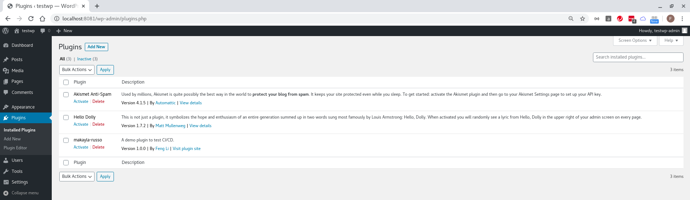

Click `Add New`


Click `Upload Plugin`

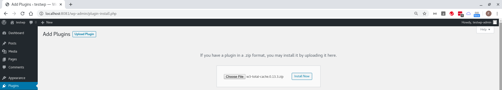

Choose `w3-total-cache.0.13.3.zip` file and click `Install now`

## error 1


```
[fli@192-168-1-4 easy-wordpress-docker]$ docker container ls
CONTAINER ID        IMAGE                          COMMAND                  CREATED             STATUS              PORTS                    NAMES
f7dc8e10fe84        wordpress-cli                  "docker-entrypoint.s…"   6 hours ago         Up 6 hours                                   wordpress-cli
9ce1c29f7c7e        wordpress-web                  "docker-php-entrypoi…"   6 hours ago         Up 6 hours          0.0.0.0:8081->80/tcp     wordpress-web
b91c11c90ea8        phpmyadmin/phpmyadmin:latest   "/docker-entrypoint.…"   6 hours ago         Up 6 hours          0.0.0.0:8080->80/tcp     phpmyadmin
8a18c283e7da        wordpress-db                   "docker-entrypoint.s…"   6 hours ago         Up 6 hours          0.0.0.0:3306->3306/tcp   wordpress-db
[fli@192-168-1-4 easy-wordpress-docker]$ 
[fli@192-168-1-4 easy-wordpress-docker]$ docker exec -it 9ce php -i | grep 'upload_max_filesize'
upload_max_filesize => 2M => 2M
[fli@192-168-1-4 easy-wordpress-docker]$ 
```

To fix it, updating `docker/web/Dockerfile` and restarting everything

```
[fli@192-168-1-4 easy-wordpress-docker]$ cat docker/web/Dockerfile 
FROM php:7.3-apache

ADD https://raw.githubusercontent.com/mlocati/docker-php-extension-installer/master/install-php-extensions /usr/local/bin/

RUN chmod uga+x /usr/local/bin/install-php-extensions && sync && \
    install-php-extensions mysqli

RUN mv "$PHP_INI_DIR/php.ini-production" "$PHP_INI_DIR/php.ini"
RUN sed -i 's/upload_max_filesize = 2M/upload_max_filesize = 4M/' "$PHP_INI_DIR/php.ini" 

VOLUME /var/www/html
[fli@192-168-1-4 easy-wordpress-docker]$ 

docker-compose up -d --build

[fli@192-168-1-4 easy-wordpress-docker]$ docker container ls
CONTAINER ID        IMAGE                          COMMAND                  CREATED             STATUS              PORTS                    NAMES
2943d7205635        wordpress-cli                  "docker-entrypoint.s…"   15 seconds ago      Up 13 seconds                                wordpress-cli
1a537f549063        phpmyadmin/phpmyadmin:latest   "/docker-entrypoint.…"   18 seconds ago      Up 15 seconds       0.0.0.0:8080->80/tcp     phpmyadmin
97e7ad1810ae        wordpress-web                  "docker-php-entrypoi…"   18 seconds ago      Up 15 seconds       0.0.0.0:8081->80/tcp     wordpress-web
d494173f31a5        wordpress-db                   "docker-entrypoint.s…"   19 seconds ago      Up 17 seconds       0.0.0.0:3306->3306/tcp   wordpress-db
[fli@192-168-1-4 easy-wordpress-docker]$ docker exec -it 97e php -i | grep 'upload_max_filesize'
upload_max_filesize => 4M => 4M
[fli@192-168-1-4 easy-wordpress-docker]$ 
```

## error 2


To fix it, need to grant `www-data` write priviledge to `/var/www/html`

```
[fli@192-168-1-4 easy-wordpress-docker]$ id
uid=1000(fli) gid=1000(fli) groups=1000(fli),10(wheel),981(docker),988(libvirt) context=unconfined_u:unconfined_r:unconfined_t:s0-s0:c0.c1023
[fli@192-168-1-4 easy-wordpress-docker]$ 
[fli@192-168-1-4 easy-wordpress-docker]$ docker exec -it 97e grep www-data /etc/passwd
www-data:x:33:33:www-data:/var/www:/usr/sbin/nologin
[fli@192-168-1-4 easy-wordpress-docker]$ docker exec -it 97e ls -l /var/www/html
total 208
-rw-rw-r--.  1 1000 1000   405 May 12 13:01 index.php
-rw-rw-r--.  1 1000 1000 19915 May 12 13:01 license.txt
-rw-rw-r--.  1 1000 1000  7278 May 12 13:01 readme.html
-rw-rw-r--.  1 1000 1000  6912 May 12 13:01 wp-activate.php
drwxrwxr-x.  9 1000 1000  4096 May 12 13:01 wp-admin
-rw-rw-r--.  1 1000 1000   351 May 12 13:01 wp-blog-header.php
-rw-rw-r--.  1 1000 1000  2275 May 12 13:01 wp-comments-post.php
-rw-rw-r--.  1 1000 1000  2823 May 12 13:01 wp-config-sample.php
-rw-rw-r--.  1 1000 1000  3195 May 13 12:25 wp-config.php
drwxrwxr-x.  4 1000 1000    52 May 12 13:01 wp-content
-rw-rw-r--.  1 1000 1000  3940 May 12 13:01 wp-cron.php
drwxrwxr-x. 21 1000 1000  8192 May 12 13:01 wp-includes
-rw-rw-r--.  1 1000 1000  2496 May 12 13:01 wp-links-opml.php
-rw-rw-r--.  1 1000 1000  3300 May 12 13:01 wp-load.php
-rw-rw-r--.  1 1000 1000 47874 May 12 13:01 wp-login.php
-rw-rw-r--.  1 1000 1000  8509 May 12 13:01 wp-mail.php
-rw-rw-r--.  1 1000 1000 19396 May 12 13:01 wp-settings.php
-rw-rw-r--.  1 1000 1000 31111 May 12 13:01 wp-signup.php
-rw-rw-r--.  1 1000 1000  4755 May 12 13:01 wp-trackback.php
-rw-rw-r--.  1 1000 1000  3133 May 12 13:01 xmlrpc.php
[fli@192-168-1-4 easy-wordpress-docker]$ 
```

## install plugin by copy 

```
unzip Downloads/w3-total-cache.0.13.3.zip -d easy-wordpress-docker/app/wp-content/plugins
docker-compose up -d --build
```

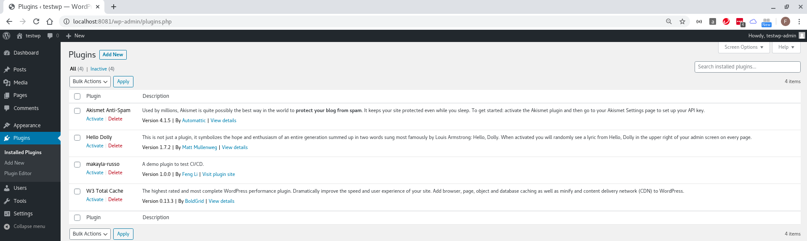

* Activate `w3-total-cache` plugin

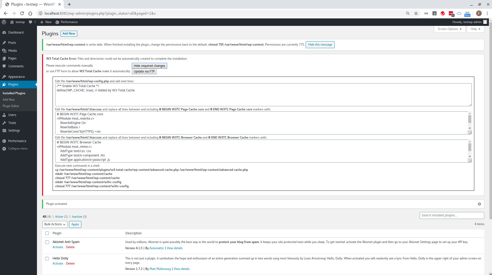

* W3 Total Cache Error: Files and directories could not be automatically created to complete the installation. Please execute commands manually.

  1. Edit file `/var/www/html/wp-config.php` and add next lines:
```
/** Enable W3 Total Cache */
define('WP_CACHE', true); // Added by W3 Total Cache
```

  2. Edit file `/var/www/html/.htaccess` and replace all lines between and including `# BEGIN W3TC Page Cache core` and `# END W3TC Page Cache core` markers with:
```
# BEGIN W3TC Page Cache core
<IfModule mod_rewrite.c>
    RewriteEngine On
    RewriteBase /
    RewriteCond %{HTTPS} =on
    RewriteRule .* - [E=W3TC_SSL:_ssl]
    RewriteCond %{SERVER_PORT} =443
    RewriteRule .* - [E=W3TC_SSL:_ssl]
    RewriteCond %{HTTP:X-Forwarded-Proto} =https [NC]
    RewriteRule .* - [E=W3TC_SSL:_ssl]
    RewriteCond %{HTTP:Accept-Encoding} gzip
    RewriteRule .* - [E=W3TC_ENC:_gzip]
    RewriteCond %{HTTP_COOKIE} w3tc_preview [NC]
    RewriteRule .* - [E=W3TC_PREVIEW:_preview]
    RewriteCond %{REQUEST_METHOD} !=POST
    RewriteCond %{QUERY_STRING} =""
    RewriteCond %{HTTP_COOKIE} !(comment_author|wp\-postpass|w3tc_logged_out|wordpress_logged_in|wptouch_switch_toggle) [NC]
    RewriteCond "%{DOCUMENT_ROOT}/wp-content/cache/page_enhanced/%{HTTP_HOST}/%{REQUEST_URI}/_index%{ENV:W3TC_SSL}%{ENV:W3TC_PREVIEW}.html%{ENV:W3TC_ENC}" -f
    RewriteRule .* "/wp-content/cache/page_enhanced/%{HTTP_HOST}/%{REQUEST_URI}/_index%{ENV:W3TC_SSL}%{ENV:W3TC_PREVIEW}.html%{ENV:W3TC_ENC}" [L]
</IfModule>
# END W3TC Page Cache core
```

  3. Edit file `/var/www/html/.htaccess` and replace all lines between and including `# BEGIN W3TC Browser Cache` and `# END W3TC Browser Cache` markers with:
```
# BEGIN W3TC Browser Cache
<IfModule mod_mime.c>
    AddType text/css .css
    AddType text/x-component .htc
    AddType application/x-javascript .js
    AddType application/javascript .js2
    AddType text/javascript .js3
    AddType text/x-js .js4
    AddType video/asf .asf .asx .wax .wmv .wmx
    AddType video/avi .avi
    AddType image/bmp .bmp
    AddType application/java .class
    AddType video/divx .divx
    AddType application/msword .doc .docx
    AddType application/vnd.ms-fontobject .eot
    AddType application/x-msdownload .exe
    AddType image/gif .gif
    AddType application/x-gzip .gz .gzip
    AddType image/x-icon .ico
    AddType image/jpeg .jpg .jpeg .jpe
    AddType image/webp .webp
    AddType application/json .json
    AddType application/vnd.ms-access .mdb
    AddType audio/midi .mid .midi
    AddType video/quicktime .mov .qt
    AddType audio/mpeg .mp3 .m4a
    AddType video/mp4 .mp4 .m4v
    AddType video/mpeg .mpeg .mpg .mpe
    AddType video/webm .webm
    AddType application/vnd.ms-project .mpp
    AddType application/x-font-otf .otf
    AddType application/vnd.ms-opentype ._otf
    AddType application/vnd.oasis.opendocument.database .odb
    AddType application/vnd.oasis.opendocument.chart .odc
    AddType application/vnd.oasis.opendocument.formula .odf
    AddType application/vnd.oasis.opendocument.graphics .odg
    AddType application/vnd.oasis.opendocument.presentation .odp
    AddType application/vnd.oasis.opendocument.spreadsheet .ods
    AddType application/vnd.oasis.opendocument.text .odt
    AddType audio/ogg .ogg
    AddType application/pdf .pdf
    AddType image/png .png
    AddType application/vnd.ms-powerpoint .pot .pps .ppt .pptx
    AddType audio/x-realaudio .ra .ram
    AddType image/svg+xml .svg .svgz
    AddType application/x-shockwave-flash .swf
    AddType application/x-tar .tar
    AddType image/tiff .tif .tiff
    AddType application/x-font-ttf .ttf .ttc
    AddType application/vnd.ms-opentype ._ttf
    AddType audio/wav .wav
    AddType audio/wma .wma
    AddType application/vnd.ms-write .wri
    AddType application/font-woff .woff
    AddType application/font-woff2 .woff2
    AddType application/vnd.ms-excel .xla .xls .xlsx .xlt .xlw
    AddType application/zip .zip
</IfModule>
<IfModule mod_expires.c>
    ExpiresActive On
    ExpiresByType text/css A31536000
    ExpiresByType text/x-component A31536000
    ExpiresByType application/x-javascript A31536000
    ExpiresByType application/javascript A31536000
    ExpiresByType text/javascript A31536000
    ExpiresByType text/x-js A31536000
    ExpiresByType video/asf A31536000
    ExpiresByType video/avi A31536000
    ExpiresByType image/bmp A31536000
    ExpiresByType application/java A31536000
    ExpiresByType video/divx A31536000
    ExpiresByType application/msword A31536000
    ExpiresByType application/vnd.ms-fontobject A31536000
    ExpiresByType application/x-msdownload A31536000
    ExpiresByType image/gif A31536000
    ExpiresByType application/x-gzip A31536000
    ExpiresByType image/x-icon A31536000
    ExpiresByType image/jpeg A31536000
    ExpiresByType image/webp A31536000
    ExpiresByType application/json A31536000
    ExpiresByType application/vnd.ms-access A31536000
    ExpiresByType audio/midi A31536000
    ExpiresByType video/quicktime A31536000
    ExpiresByType audio/mpeg A31536000
    ExpiresByType video/mp4 A31536000
    ExpiresByType video/mpeg A31536000
    ExpiresByType video/webm A31536000
    ExpiresByType application/vnd.ms-project A31536000
    ExpiresByType application/x-font-otf A31536000
    ExpiresByType application/vnd.ms-opentype A31536000
    ExpiresByType application/vnd.oasis.opendocument.database A31536000
    ExpiresByType application/vnd.oasis.opendocument.chart A31536000
    ExpiresByType application/vnd.oasis.opendocument.formula A31536000
    ExpiresByType application/vnd.oasis.opendocument.graphics A31536000
    ExpiresByType application/vnd.oasis.opendocument.presentation A31536000
    ExpiresByType application/vnd.oasis.opendocument.spreadsheet A31536000
    ExpiresByType application/vnd.oasis.opendocument.text A31536000
    ExpiresByType audio/ogg A31536000
    ExpiresByType application/pdf A31536000
    ExpiresByType image/png A31536000
    ExpiresByType application/vnd.ms-powerpoint A31536000
    ExpiresByType audio/x-realaudio A31536000
    ExpiresByType image/svg+xml A31536000
    ExpiresByType application/x-shockwave-flash A31536000
    ExpiresByType application/x-tar A31536000
    ExpiresByType image/tiff A31536000
    ExpiresByType application/x-font-ttf A31536000
    ExpiresByType application/vnd.ms-opentype A31536000
    ExpiresByType audio/wav A31536000
    ExpiresByType audio/wma A31536000
    ExpiresByType application/vnd.ms-write A31536000
    ExpiresByType application/font-woff A31536000
    ExpiresByType application/font-woff2 A31536000
    ExpiresByType application/vnd.ms-excel A31536000
    ExpiresByType application/zip A31536000
</IfModule>
<IfModule mod_deflate.c>
    <IfModule mod_filter.c>
        AddOutputFilterByType DEFLATE text/css text/x-component application/x-javascript application/javascript text/javascript text/x-js text/html text/richtext text/plain text/xsd text/xsl text/xml image/bmp application/java application/msword application/vnd.ms-fontobject application/x-msdownload image/x-icon application/json application/vnd.ms-access video/webm application/vnd.ms-project application/x-font-otf application/vnd.ms-opentype application/vnd.oasis.opendocument.database application/vnd.oasis.opendocument.chart application/vnd.oasis.opendocument.formula application/vnd.oasis.opendocument.graphics application/vnd.oasis.opendocument.presentation application/vnd.oasis.opendocument.spreadsheet application/vnd.oasis.opendocument.text audio/ogg application/pdf application/vnd.ms-powerpoint image/svg+xml application/x-shockwave-flash image/tiff application/x-font-ttf application/vnd.ms-opentype audio/wav application/vnd.ms-write application/font-woff application/font-woff2 application/vnd.ms-excel
    <IfModule mod_mime.c>
        # DEFLATE by extension
        AddOutputFilter DEFLATE js css htm html xml
    </IfModule>
    </IfModule>
</IfModule>
<FilesMatch "\.(css|htc|less|js|js2|js3|js4|CSS|HTC|LESS|JS|JS2|JS3|JS4)$">
    FileETag MTime Size
    <IfModule mod_headers.c>
         Header unset Set-Cookie
    </IfModule>
</FilesMatch>
<FilesMatch "\.(html|htm|rtf|rtx|txt|xsd|xsl|xml|HTML|HTM|RTF|RTX|TXT|XSD|XSL|XML)$">
    FileETag MTime Size
</FilesMatch>
<FilesMatch "\.(asf|asx|wax|wmv|wmx|avi|bmp|class|divx|doc|docx|eot|exe|gif|gz|gzip|ico|jpg|jpeg|jpe|webp|json|mdb|mid|midi|mov|qt|mp3|m4a|mp4|m4v|mpeg|mpg|mpe|webm|mpp|otf|_otf|odb|odc|odf|odg|odp|ods|odt|ogg|pdf|png|pot|pps|ppt|pptx|ra|ram|svg|svgz|swf|tar|tif|tiff|ttf|ttc|_ttf|wav|wma|wri|woff|woff2|xla|xls|xlsx|xlt|xlw|zip|ASF|ASX|WAX|WMV|WMX|AVI|BMP|CLASS|DIVX|DOC|DOCX|EOT|EXE|GIF|GZ|GZIP|ICO|JPG|JPEG|JPE|WEBP|JSON|MDB|MID|MIDI|MOV|QT|MP3|M4A|MP4|M4V|MPEG|MPG|MPE|WEBM|MPP|OTF|_OTF|ODB|ODC|ODF|ODG|ODP|ODS|ODT|OGG|PDF|PNG|POT|PPS|PPT|PPTX|RA|RAM|SVG|SVGZ|SWF|TAR|TIF|TIFF|TTF|TTC|_TTF|WAV|WMA|WRI|WOFF|WOFF2|XLA|XLS|XLSX|XLT|XLW|ZIP)$">
    FileETag MTime Size
    <IfModule mod_headers.c>
         Header unset Set-Cookie
    </IfModule>
</FilesMatch>
<FilesMatch "\.(bmp|class|doc|docx|eot|exe|ico|json|mdb|webm|mpp|otf|_otf|odb|odc|odf|odg|odp|ods|odt|ogg|pdf|pot|pps|ppt|pptx|svg|svgz|swf|tif|tiff|ttf|ttc|_ttf|wav|wri|woff|woff2|xla|xls|xlsx|xlt|xlw|BMP|CLASS|DOC|DOCX|EOT|EXE|ICO|JSON|MDB|WEBM|MPP|OTF|_OTF|ODB|ODC|ODF|ODG|ODP|ODS|ODT|OGG|PDF|POT|PPS|PPT|PPTX|SVG|SVGZ|SWF|TIF|TIFF|TTF|TTC|_TTF|WAV|WRI|WOFF|WOFF2|XLA|XLS|XLSX|XLT|XLW)$">
    <IfModule mod_headers.c>
         Header unset Last-Modified
    </IfModule>
</FilesMatch>
<IfModule mod_headers.c>
    Header set Referrer-Policy "no-referrer-when-downgrade"
</IfModule>
# END W3TC Browser Cache
```

  4. Execute next commands in a shell:
```
cp /var/www/html/wp-content/plugins/w3-total-cache/wp-content/advanced-cache.php /var/www/html/wp-content/advanced-cache.php
mkdir /var/www/html/wp-content/cache
chmod 777 /var/www/html/wp-content/cache
mkdir /var/www/html/wp-content/w3tc-config
chmod 777 /var/www/html/wp-content/w3tc-config
```

* `chmod` command to `/var/www/html/wp-content/cache` & `/var/www/html/wp-content/w3tc-config`
```
[fli@192-168-1-4 easy-wordpress-docker]$ docker container ls
CONTAINER ID        IMAGE                          COMMAND                  CREATED             STATUS              PORTS                    NAMES
2302f9f11f99        wordpress-cli                  "docker-entrypoint.s…"   7 minutes ago       Up 7 minutes                                 wordpress-cli
5e6bcb2d4d00        phpmyadmin/phpmyadmin:latest   "/docker-entrypoint.…"   7 minutes ago       Up 7 minutes        0.0.0.0:8080->80/tcp     phpmyadmin
92556b167d97        wordpress-web                  "docker-php-entrypoi…"   7 minutes ago       Up 7 minutes        0.0.0.0:8081->80/tcp     wordpress-web
c2277fc6141b        wordpress-db                   "docker-entrypoint.s…"   7 minutes ago       Up 7 minutes        0.0.0.0:3306->3306/tcp   wordpress-db
[fli@192-168-1-4 easy-wordpress-docker]$ docker exec -it 925 ls -l /var/www/html/wp-content/cache
total 0
[fli@192-168-1-4 easy-wordpress-docker]$ docker exec -it 925 ls -l /var/www/html/wp-content
total 8
-rw-r--r--. 1 1000 1000 1188 May 14 00:34 advanced-cache.php
drwxrwxr-x. 2 1000 1000    6 May 14 00:34 cache
-rw-rw-r--. 1 1000 1000   28 May 12 13:01 index.php
drwxrwxr-x. 5 1000 1000   98 May 14 00:14 plugins
drwxrwxr-x. 5 1000 1000   88 May 12 13:01 themes
drwxrwxr-x. 2 1000 1000    6 May 14 00:37 w3tc-config
[fli@192-168-1-4 easy-wordpress-docker]$ docker exec -it 925 chmod 777 /var/www/html/wp-content/cache
[fli@192-168-1-4 easy-wordpress-docker]$ docker exec -it 925 chmod 777 /var/www/html/wp-content/w3tc-config
[fli@192-168-1-4 easy-wordpress-docker]$ docker exec -it 925 ls -l /var/www/html/wp-content
total 8
-rw-r--r--. 1 1000 1000 1188 May 14 00:34 advanced-cache.php
drwxrwxrwx. 2 1000 1000    6 May 14 00:34 cache
-rw-rw-r--. 1 1000 1000   28 May 12 13:01 index.php
drwxrwxr-x. 5 1000 1000   98 May 14 00:14 plugins
drwxrwxr-x. 5 1000 1000   88 May 12 13:01 themes
drwxrwxrwx. 2 1000 1000    6 May 14 00:37 w3tc-config
[fli@192-168-1-4 easy-wordpress-docker]$ 

[fli@192-168-1-4 easy-wordpress-docker]$ docker exec -it 925 ls -l /var/www/html | grep wp-content
drwxrwxr-x.  6 1000 1000   110 May 14 00:37 wp-content
[fli@192-168-1-4 easy-wordpress-docker]$ docker exec -it 925 chmod 755 /var/www/html/wp-content
[fli@192-168-1-4 easy-wordpress-docker]$ docker exec -it 925 ls -l /var/www/html | grep wp-content
drwxr-xr-x.  6 1000 1000   110 May 14 00:37 wp-content
[fli@192-168-1-4 easy-wordpress-docker]$ 
```

## `w3-total-cache` activate

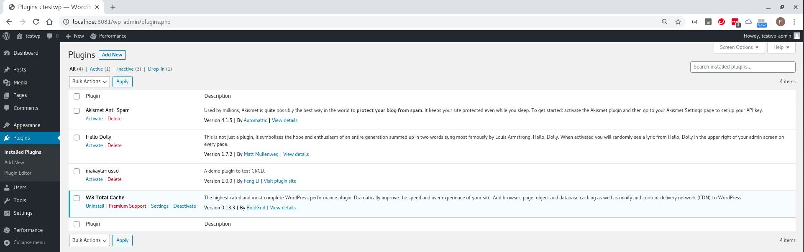

## `w3-total-cache` Settings

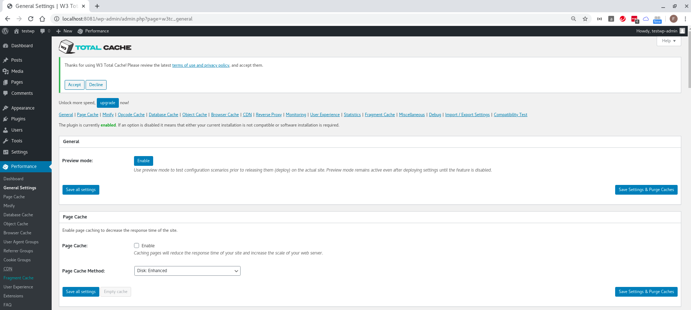
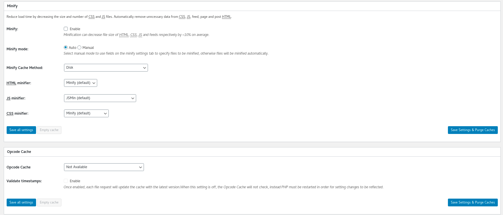
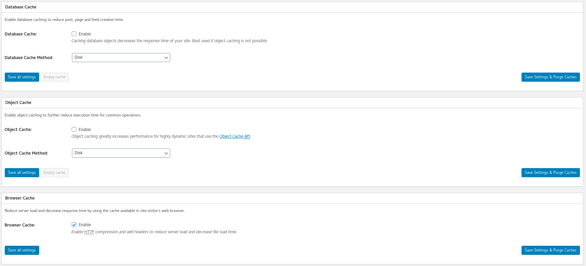
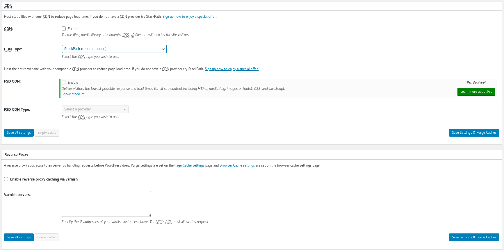
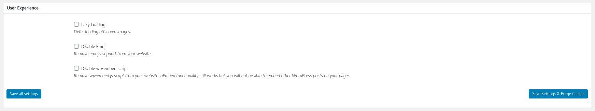
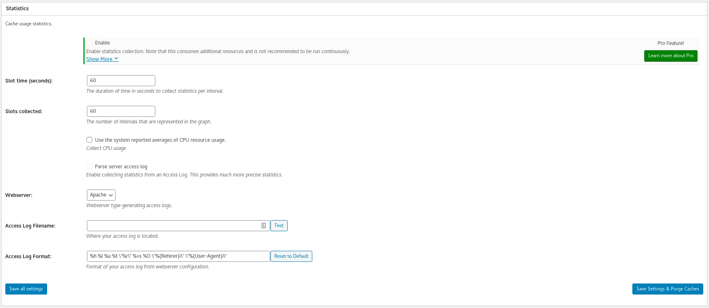
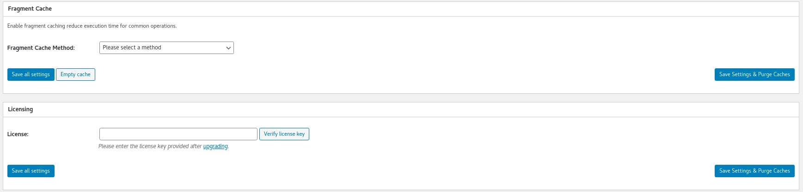
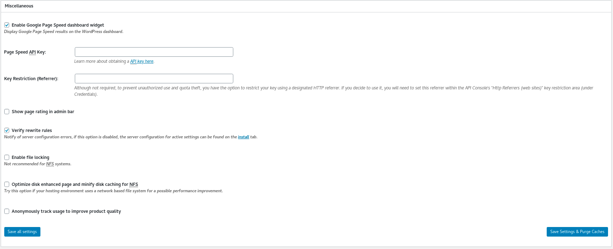
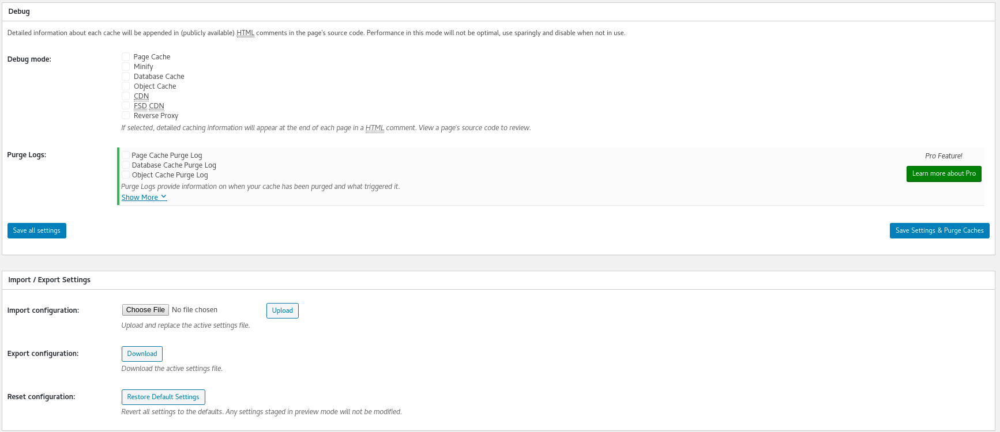
