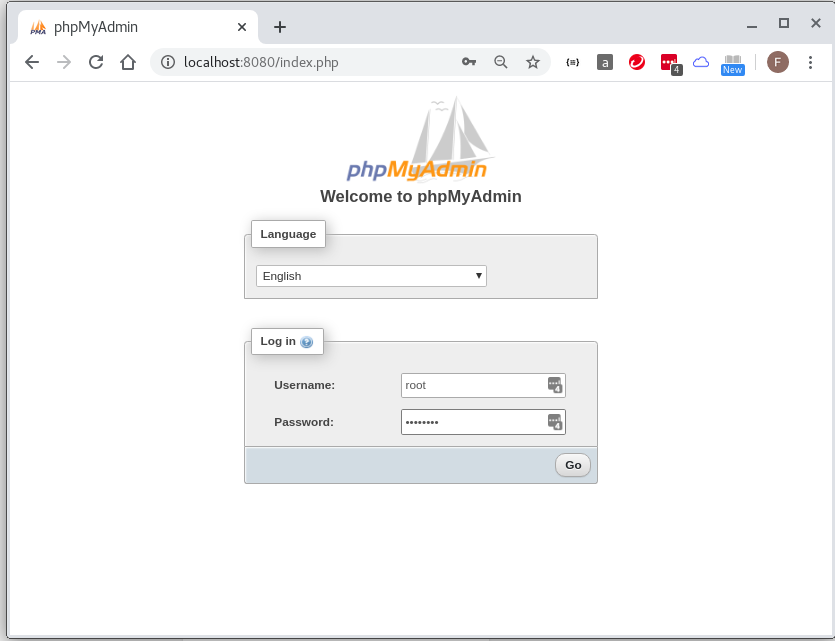
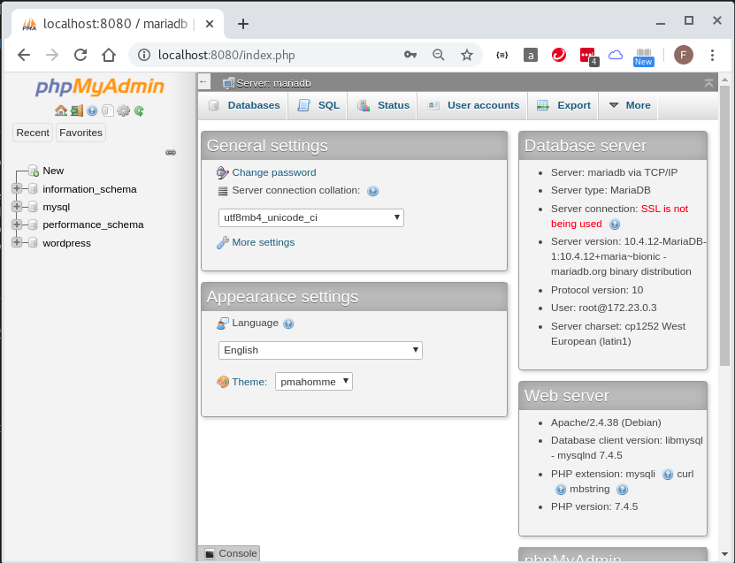
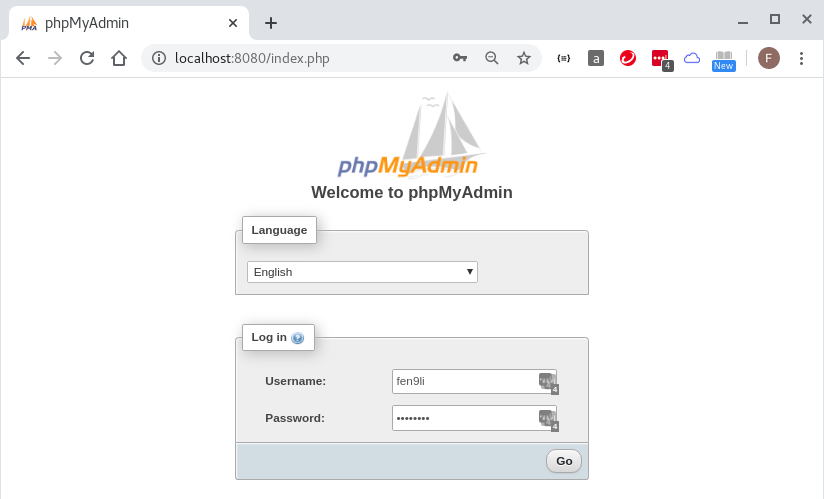
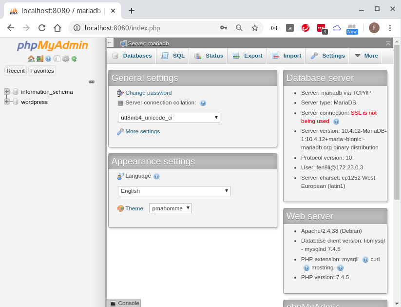
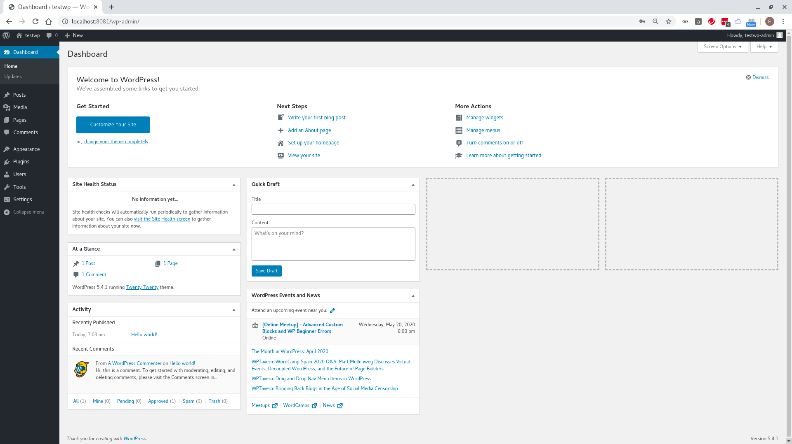
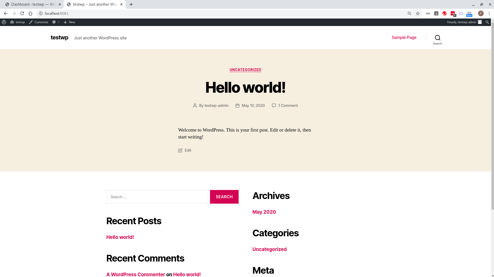

## wp-local-dev-basic build guide 

* spinning up `docker-compose up -d --build`

* testing phpmyadmin can access mariadb at `localhost:8080` as both `root` and user `fen9li`









* testing wordpress at `localhost:8081`

| Key | Value |
| --- | ----- |
| Site Title | testwp |
| Username | testwp-admin |
| Password | l#)%T1XDQA8GfEExs$ |
| Your Email | lifcn@yahoo.com |
| Search Engine Visibility | untick |





## exploring

```
docker-compose stop
docker-compose start

[fli@192-168-1-4 easy-wordpress-docker]$ docker container ls
CONTAINER ID        IMAGE                          COMMAND                  CREATED              STATUS              PORTS                    NAMES
0b18738afc4e        phpmyadmin/phpmyadmin:latest   "/docker-entrypoint.…"   About a minute ago   Up About a minute   0.0.0.0:8080->80/tcp     phpmyadmin
b00ae69557fb        wordpress-web                  "docker-php-entrypoi…"   About a minute ago   Up About a minute   0.0.0.0:8081->80/tcp     wordpress-web
9142f2953acd        wordpress-db                   "docker-entrypoint.s…"   About a minute ago   Up About a minute   0.0.0.0:3306->3306/tcp   wordpress-db
[fli@192-168-1-4 easy-wordpress-docker]$ 

[fli@192-168-1-4 easy-wordpress-docker]$ docker exec -it b00 ls /var/www/html
index.php        wp-blog-header.php    wp-cron.php        wp-mail.php
license.txt      wp-comments-post.php  wp-includes        wp-settings.php
readme.html      wp-config-sample.php  wp-links-opml.php  wp-signup.php
wp-activate.php  wp-config.php         wp-load.php        wp-trackback.php
wp-admin         wp-content            wp-login.php       xmlrpc.php
[fli@192-168-1-4 easy-wordpress-docker]$  
```
