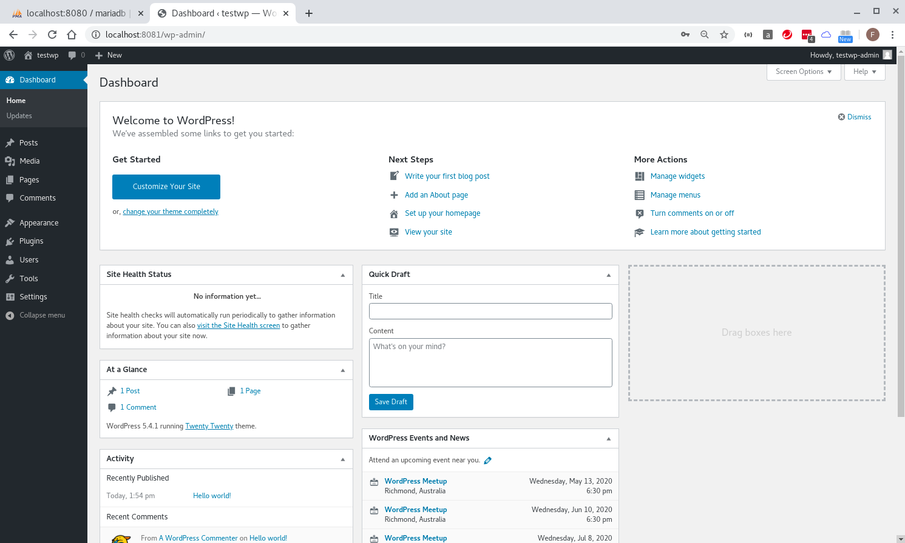

## wp-local-dev-basic build guide 

* spinning up 

```
docker-compose up -d --build

[fli@192-168-1-4 easy-wordpress-docker]$ docker container ls
CONTAINER ID        IMAGE                          COMMAND                  CREATED             STATUS              PORTS                    NAMES
dd27281da692        wordpress:latest               "docker-entrypoint.s…"   7 seconds ago       Up 5 seconds        0.0.0.0:8081->80/tcp     wordpress
74aff79a32d8        phpmyadmin/phpmyadmin:latest   "/docker-entrypoint.…"   7 seconds ago       Up 5 seconds        0.0.0.0:8080->80/tcp     phpmyadmin
1f58e8931e9b        mariadb:latest                 "docker-entrypoint.s…"   9 seconds ago       Up 8 seconds        0.0.0.0:3306->3306/tcp   mariadb
[fli@192-168-1-4 easy-wordpress-docker]$ 
```

* testing phpmyadmin can access mariadb at `localhost:8080` as both `root` and user `fen9li`


* testing and installing wordpress at `localhost:8081`


| Key | Value |
| --- | ----- |
| Site Title | testwp |
| Username | testwp-admin |
| Password | l#)%T1XDQA8GfEExs$ |
| Your Email | lifcn@yahoo.com |
| Search Engine Visibility | untick |





## exploring

```
docker-compose stop
docker-compose start

[fli@192-168-1-4 easy-wordpress-docker]$ docker container ls --all
CONTAINER ID        IMAGE                          COMMAND                  CREATED             STATUS                          PORTS               NAMES
c4ab55e8f7d0        wordpress:latest               "docker-entrypoint.s…"   About an hour ago   Exited (0) About a minute ago                       wordpress
5cbdf52c23d9        phpmyadmin/phpmyadmin:latest   "/docker-entrypoint.…"   About an hour ago   Exited (0) About a minute ago                       phpmyadmin
0211452970b4        mariadb:latest                 "docker-entrypoint.s…"   About an hour ago   Exited (0) 57 seconds ago                           mariadb
[fli@192-168-1-4 easy-wordpress-docker]$ 
```
